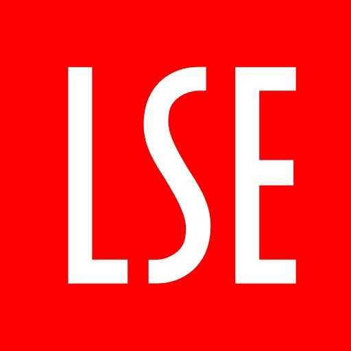

# The Systems Aware Quality Attribute Workshop (SAQAW) Document Repository
This is the Document Repository for the Systems Aware Quality Attribute Workshop (SAQAW). The SAQAW was developed as part of my masters thesis :mortar_board: at the London School of Economics and Political Science (LSE) &nbsp;&nbsp;&nbsp;&nbsp;.

The SAQAW is an attempt to combine the [Quality Attribute Workshop (QAW)](https://insights.sei.cmu.edu/library/quality-attribute-workshop-collection/), developed by the Carnegie Mellon Software Engineering Institute with the benefits of the [Soft Systems Methodology (SSM)](https://en.wikipedia.org/wiki/Soft_systems_methodology), developed by Peter Checkland, to introduce a new and innovate way for Software Architecture Requirements elicitation. 

### :question: Why is this needed?
Previous works have clearly showcased how SSM can help in Software Development Projects. Some examples can be found here:

- Sewchurran, K., & Petkov, D. (2007). A Systemic framework for Business Process Modeling Combining Soft Systems Methodology and UML. Information Resources Management Journal, Volume 20, Issue 3, 46 - 62.
- Salahat, M., & Wade, S. (2009). A Systems Thinking Approach to Domain-Driven Design. UK Academy for Information Systems Conference Proceedings 2009, (p. 44).
- Cloutier, R., Sauser, B., Bone, M., & Taylor, A. (2015). Transitioning Systems Thinking to Model-Based Systems Engineering: Systemigrams to SysML Models. IEEE TRANSACTIONS ON SYSTEMS, MAN, AND CYBERNETICS: SYSTEMS, VOL. 45, NO. 4, 662 - 674.

While these works are great, Software Architecture is also driven by non functional requirements (NFRs). The existing approaches focus mostly on functional requirements, which inspired me to propose the SAQAW. This method not only extends Soft Systems Thinking to Software Architecture requirements elicitation but also neatly integrates with other methods in the process such as the [Attribute-Driven Design Method (ADD)](https://insights.sei.cmu.edu/library/attribute-driven-design-method-collection/) or the [Architecture Tradeoff Analysis Method (ATAM)](https://insights.sei.cmu.edu/library/atam-method-for-architecture-evaluation/) .

### :checkered_flag: What is this repository for?

Primary use cases: 
:file_folder: Store files related to the SAQAW to be reused by others who want to adopt the method  
:loudspeaker: Provide a forum to discuss anything related to the method
  
In the more general sense: 
:earth_asia: Open up the method to a world-wide community of researchers and practicioners to develop further  
:bulb: Inspire Software Engineers to adopt a view beyond technology  
:seedling: Serve as the foundation for any future research endeavours for the exaptation of (Soft) Systems Thinking into Software Architecture

### :octocat: How you can contribute
Feel free to contribute anything related to the SAQAW. This includes especially:
- Any materials and documents that might help others in adoption
- Experience Reports
- Helpful Tools and Resources

Just open a pull request adding the suggested content and I will review it.

### :page_facing_up: Contents
:blue_book: [Method description](Method.md) 
:triangular_ruler: [List Helpful Tools for the workshop](resources/Tools.md) 
:pencil: [Workshop Presentation Template](templates/Intro_Presentation_Template_Unformatted.pdf)  
:hourglass: [Workshop Sample Schedule](templates/Schedule.md)

### :clap: Acknowledgements

Special thanks to [Prof. Dr. Carsten Sørensen](http://carstensorensen.com/) for supervising my thesis and providing me with invalueable guidance on how to approach this project. 

Also, I want to thank [Prof. Dr. Will Venters]( https://www.lse.ac.uk/management/people/academic-staff/will-venters) and [Dr. Juan Camilo Giraldo-Mora](https://www.lse.ac.uk/management/people/academic-staff/juan-camilo-giraldo-mora) for introducing me to SSM and helping me in shaping my early ideas for this project.
